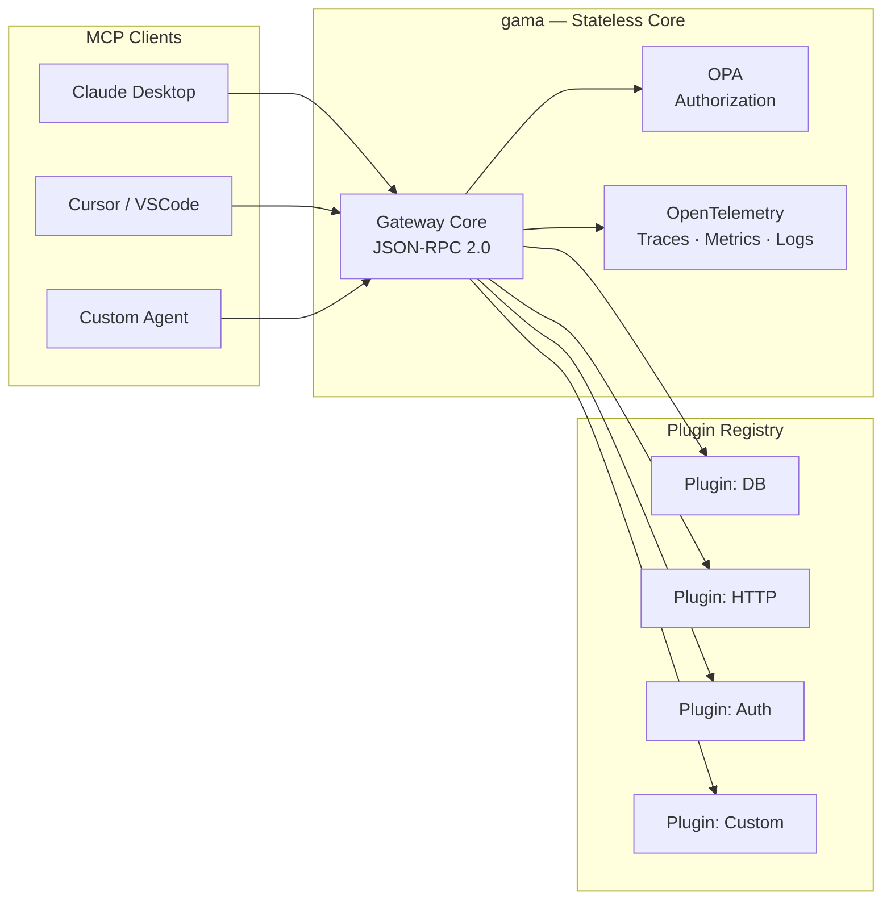
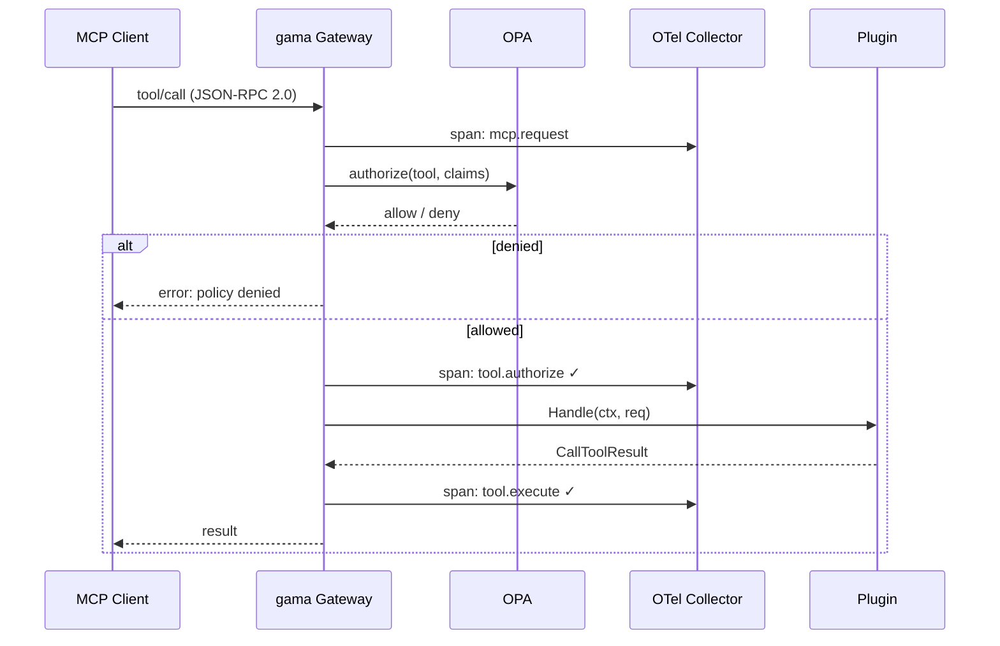
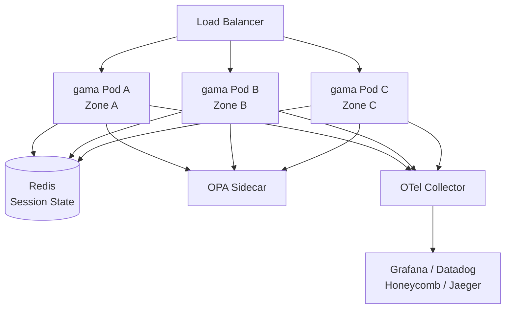
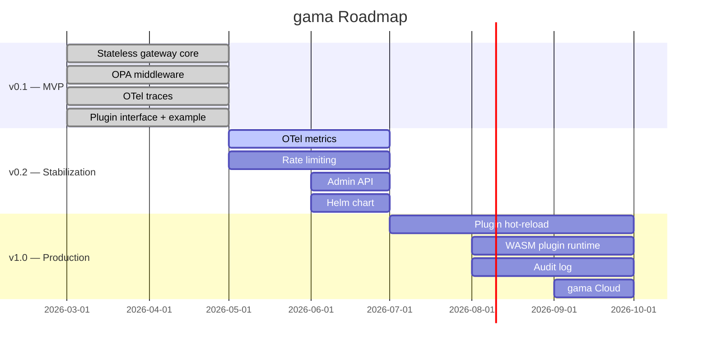

# gama

**MCP Gateway for platform teams.**  
Stateless · Plugin-based · OPA policies · OpenTelemetry · Built in Go.



---

## Why gama?

Most MCP setups today run without a control plane.  
Tools are scattered, authorization is bespoke, and observability is an afterthought.

**gama** is the layer between your AI clients and your MCP tools — a single, stateless gateway
that enforces policy, emits traces, and lets you extend behavior through plugins,
without locking you into any vendor.

---

## Features

- **Stateless core** — every pod is identical; scale horizontally without sticky sessions
- **OPA authorization** — enforce tool-level policies with Rego; no redeploy required to change rules
- **OpenTelemetry** — traces, metrics and logs on every tool call, out of the box
- **Plugin system** — implement the `ToolPlugin` interface in Go; gama discovers and registers your tools at runtime
- **MCP spec compliant** — supports Streamable HTTP and stdio transports (spec 2025-11-25)
- **HA ready** — designed for Kubernetes with HPA autoscaling

---

## Quick Start

```bash
# Install
go install github.com/alejandrohrdzmtz/gama@latest

# Run with a plugin
gama serve \
  --plugin ./plugins/mydb \
  --opa http://localhost:8181 \
  --port 8080
```

Connect any MCP client (Claude Desktop, Cursor, custom agent) to `http://localhost:8080/mcp`.

---

## Architecture

### Request flow



### HA Deployment



---

## Configuration

```yaml
# gama.yaml
server:
  port: 8080
  transport: streamable-http   # or stdio

opa:
  endpoint: http://opa:8181
  policy: mcp/tools/allow

telemetry:
  exporter: otlp
  endpoint: http://otel-collector:4317

plugins:
  - path: ./plugins/db
  - path: ./plugins/http-client
  - path: ./plugins/auth
```

---

## Writing a Plugin

Implement the `ToolPlugin` interface:

```go
package main

import (
    "context"
    "github.com/alejandrohrdzmtz/gama/plugin"
    "github.com/mark3labs/mcp-go/mcp"
)

type MyPlugin struct{}

func (p *MyPlugin) Name() string { return "my_tool" }

func (p *MyPlugin) Schema() mcp.Tool {
    return mcp.NewTool("my_tool",
        mcp.WithDescription("Does something useful"),
        mcp.WithString("input", mcp.Required()),
    )
}

func (p *MyPlugin) Handle(ctx context.Context, req mcp.CallToolRequest) (*mcp.CallToolResult, error) {
    input := req.Params.Arguments["input"].(string)
    return mcp.NewToolResultText("result: " + input), nil
}

var Plugin plugin.ToolPlugin = &MyPlugin{}
```

Build and register:

```bash
go build -buildmode=plugin -o plugins/my_tool.so ./my_tool
```

---

## OPA Policy Example

```rego
# policies/mcp_tools.rego
package mcp.tools

default allow = false

# Read-only tools: allow if authenticated
allow {
    startswith(input.tool, "read_")
    input.claims.sub != ""
}

# Write tools: admin only
allow {
    input.tool == "db_write"
    input.claims.role == "admin"
}
```

---

## Deployment

### Kubernetes (recommended)

```yaml
apiVersion: apps/v1
kind: Deployment
metadata:
  name: gama
spec:
  replicas: 3
  template:
    spec:
      containers:
      - name: gama
        image: ghcr.io/alejandrohrdzmtz/gama:latest
        args: ["serve", "--config", "/etc/gama/gama.yaml"]
      - name: opa
        image: openpolicyagent/opa:latest
        args: ["run", "--server", "--addr", ":8181"]
```

### Docker Compose (local dev)

```bash
docker compose up
```

---

## Observability

gama emits OpenTelemetry spans on every request:

| Span | Attributes |
|------|-----------|
| `mcp.request` | `tool`, `client_id`, `transport` |
| `tool.authorize` | `policy.result`, `policy.latency_ms` |
| `tool.execute` | `plugin.name`, `result.ok`, `latency_ms` |

Compatible with any OTLP backend: Grafana, Datadog, Honeycomb, Jaeger.

---

## Roadmap



---

## Contributing

gama is early-stage and actively looking for contributors.

```bash
git clone https://github.com/alejandrohrdzmtz/gama
cd gama
make dev        # starts local server with example plugins
make test       # runs test suite
make lint       # golangci-lint
```

See [CONTRIBUTING.md](CONTRIBUTING.md) for guidelines.

---

## Stack

- [mark3labs/mcp-go](https://github.com/mark3labs/mcp-go) — MCP protocol implementation
- [open-policy-agent/opa](https://github.com/open-policy-agent/opa) — Policy engine
- [open-telemetry/opentelemetry-go](https://github.com/open-telemetry/opentelemetry-go) — Observability

---

## License

Apache 2.0 — see [LICENSE](LICENSE).
